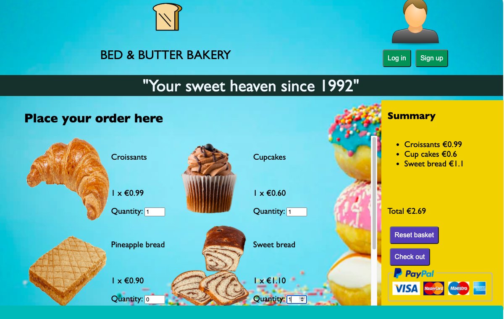

# Introduction

In this repository our team works on a small program to practice `separation-of-concerns`.  
The program allows a user to make and to edit a list of items.

The members of **Group-6** are:

- [MMikhailova](https://github.com/MMikhailova)
- [Cristobal lopez](https://github.com/cristobal-lopez)

## Project goals

- To practice creating documentation
- To master DOM, event listeners and event handlers
- To practice separating and organizing the JavaScript code into different files
- To develop a sucessful program using HTML, CSS and JavaScript

## Steps to reach the goal

- Repository set up
- 

Planning

    [communication-plan](./planning/communication-plan.md)

   [constraints](./planning/constraints.md)

    [backlog](.planing/../planning/backlog.md)
  
    [development-strategy](./planning/development-strategy.md)

  

- Project board
- Code development
- Checking code (lint, document, format)
- Pull requests

## Status

[Test our program here](https://lab-brussels-1.github.io/Group6-separation-of-concerns-starter-2.0/)
